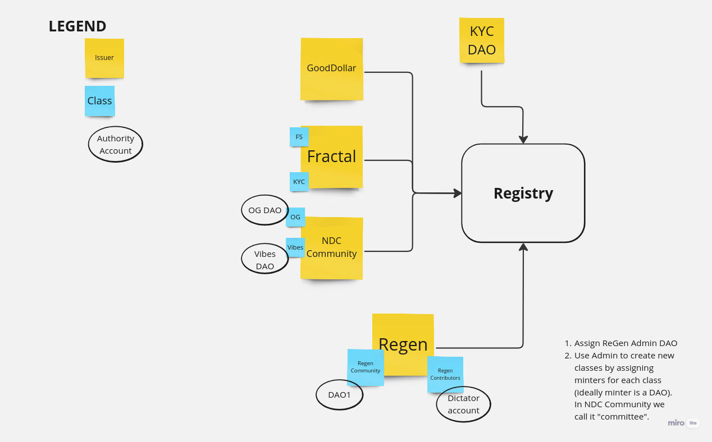

# SBT Registry

The Registry smart contract is a balance book for all associated SBT tokens. The registry enables atomic `soul_transfers` and provides an efficient way to ban a smart contract (issuer). For more details check the [nep-393](https://github.com/near/NEPs/pull/393).

## Issuing SBTs

Usually we have 4 entities involved in the minting process:

1. Issuer entity: a smart contract representing an issuer, opted-in to the registry contract, allowed to issue new SBTs. Issuer should implement authorization methods for minters to call mint functions.
   Issuer must provide an interface, to allowed minters, to call registry functions: `sbt_mint`, `sbt_mint_iah`, `sbt_renew`, `sbt_revoke`. It must also implement the [`SBTIssuer`](../sbt/src/lib.rs) trait to provide metadata information about the issuer and each token class.
   NOTE: each SBT is issued under the issuer namespace. So if we have two issuers: A and B, each one can issue SBTs independently. SBTs are queried by issuer and token ID pair. This assures correct separation between issuers.
2. Minter: an account (usually a DAO, but can be any contract or account) authorized to call Issuer mint functions. Authorization is handled by the _Issuer entity_. For example, Issuer entity can implement a role based authorization: allow different minters per class, or different accounts to handle renew.
3. Registry: a smart contract described in this library. It implements the SBT Registry as per [nep-393](https://github.com/near/NEPs/pull/393).
4. Recipient: account receiving an SBT.

The diagram below outlines different entities involved in minting process. Issuers always mints tokens under his own namespace.



### Registering an issuer

As noted above, every SBT is minted by an issuer, and it is recorded in the Registry contract, within an issuer namespace. An issuer, to be allowed to mint tokens, must firstly opt-in to the registry. Different registries may implement different mechanisms for opt-in. This implementation requires an admin account (could be a DAO) to add an issuer to the registry. The issuer opt-in mechanism is planned to be fully permissionless, once we will have more established governance and the protocol will get enough stability.

### Minting

The minting process is a procedure where an opt-in Issuer calls registry to mint a new token. Registry exposes two functions:

- `sbt_mint(token_spec: Vec<(AccountId, Vec<TokenMetadata>)>) -> Vec<TokenId>` -- creates a new, unique tokens and assigns it to the `receiver`. `token_spec` is a vector of pairs: owner AccountId and TokenMetadata. Each TokenMetadata must specify non zero `class`.
- `sbt_mint_iah(token_spec: Vec<(AccountId, Vec<TokenMetadata>)>) -> Vec<TokenId>` -- a wrapper around `sbt_mint` and `is_human`. It mints SBTs only when all recipients are humans. Panics if one of the recipients is not a human.

When calling the registry `sbt_mint*` functions, enough `Near` must be attached to cover the registry storage cost.

The functions will emit the [`Mint`](https://github.com/alpha-fi/i-am-human/blob/master/contracts/sbt/src/events.rs#L69) event when successful. There might be a case when the token vector provided is too long, and the gas is not enough to cover the minting process. In such case, the registry call will panic with `out of gas`.

## NDC Community Issuer

For NDC community SBTs, please see the [`community-sbt`](../community-sbt/README.md) contract and check with NDC leaders to be added as a minter and have your own class. The `community-sbt` contract allows to have unique set of minters per class. This way, there is no need to create a new contract for each new community, and every community will have it's own autonomy of issuing SBTs under their own class.

## Additional Queries

The IAH Registry supports the following extra queries, which are not part of the NEP-393 standard. See the function docs for more complete documentation.

- `is_human(account: AccountId) -> Proof`, where proof is list of SBTs (represented as a list of issuers and issuer minted tokens). The registry has a property `iah_sbts` that specifies which tokens from which issuers are required from an account to be considered a human. In case the account is missing any of the required tokens, or is considered a fake account (through the registry `blacklist`) an empty proof will be returned (empty list).
  For example, if `alice` is a human because she has `fractal: class 1` token with `tokenID=24`, then the function returns `["<fractal issuer account>", [24]]`. If the account is not a human, then an empty proof is returned (empty list). If the `iah_sbts` property contains more tokens, for example `fratcal: [1,2]` the `is_human` will return the proof with the tokens only if the account has both of the SBTs. Otherwise an empty proof will be returned. Eg: for `alice` with two tokens `class=1, tokenID=24` and `class=2, tokenID=40` the method will return `["<fractal issuer account>", [24, 40]]`. for `bob` with one token `class=1, tokenID=26` the method will return an empty list.

- `is_human_bool(account: AccountId) -> bool`: similar to `is_human`, but returns `true` if an account is considered human, and `false` otherwise. We DO NOT RECOMMEND using this function. You SHOULD use `is_human` instead. Returning bool may create wrong practices. Humanity will be a metric, not a true/false. Each "client" should have his own criteria and asses the humanity proof (e.g. check for KYC SBTs, liveness, ...). 
  Moreover, for some transactions it is critical to record the proof or acquire a lock (using `is_human_call_lock`) to protect from repeating action by the same human. Example scenario: consider Alice uses her humanity proof to vote, then she transfers her "soul" to another account, and votes again.

- `account_flagged(account: AccountId) -> Option<AccountFlag>` - returns account status if it was flagged. Returns None if the account was not flagged. More context about account flagging is specified in the [IAH Flag Accounts](https://near-ndc.notion.site/IAH-Flag-Accounts-b5b9c2ff72d14328834e2a0effa22938?pvs=4).

- `iah_class_set() -> ClassSet` - returns IAH class set: required token classes to be approved as a human by the `is_human`.

## Additional Transactions

See the function docs for more complete documentation.

- `sbt_mint_iah(token_spec: Vec<(AccountId, Vec<TokenMetadata>)>) -> Vec<TokenId>` is a wrapper around `sbt_mint` and `is_human`. It mints SBTs only when all recipients are humans.

- `sbt_burn(issuer: AccountId, tokens: Vec<TokenId>, memo: Option<String>)` - every holder can burn some of his tokens.

- `sbt_burn_all()` - method to burn all caller tokens (from all issuers). To efficiently burn all tokens, the method must be called repeatedly until true is returned.

- `is_human_call(ctr: AccountId, function: String, payload: JSONString)` checks if the predecessor account (_caller_) account is human (using `is_human` method). If it's not, then it panics and returns the deposit. Otherwise it makes a cross contract call passing the provided deposit:

  ```python
  ctr.function(caller=predecessor_account_id,
               iah_proof=tokens_prooving_caller_humanity,
               payload)
  ```

  Classical example will registering an action (for poll participation), only when a user is a human.
  Instead of `Poll --is_human--> Registry -> Poll`, we can simplify and do `Registry.is_human_call --> Poll`.

  See the function documentation for more details and [integration test](https://github.com/near-ndc/i-am-human/blob/780e8cf8326fd0a7976c48afbbafd4553cc7b639/contracts/human_checker/tests/workspaces.rs#L131) for usage.

- `is_human_call_lock(ctr: AccountId, function: String, lock_duration: u64, with_proof: bool)` checks if the predecessor account (_caller_) account is human (using `is_human` method). If it's not, then it panics and returns the deposit. Otherwise it will extend the _account soul transfer lock_ (blocking account ability to execute soul transfers) and make a cross contract call passing the provided deposit:

  ```python
  ctr.function(caller=predecessor_account_id,
               locked_until: time_in_ms_until_when_the_account_is_locked,
               iah_proof=tokens_prooving_caller_humanity,
               payload)
  ```

  Classical example will be a voting: we need to assure that an account won't migrate to other one using a soul transfer, and vote from two different accounts. Alternative would be to records humanity proof (SBTs) - this approach
  may be more difficult to implement, especially if we are going to supply more humanity proofs.

### Admin functions

- `admin_flag_accounts(flag: AccountFlag, accounts: Vec<AccountId>, memo: String)` - sets a flag for every account in the `accounts` list, overwriting if needed. Must be called by an authorized flagger.
- `admin_flag_accounts(flag: AccountFlag, accounts: Vec<AccountId>, memo: String)` - removes a flag for every account in the `accounts` list, overwriting if needed. Must be called by an authorized flagger.
  Valid account flags are: "Verified", "Blacklisted", "GovBan".
- `admin_add_sbt_issuer(issuer: AccountId)` - authorizes new issuer to issue SBTs.

## Soul transfer

The registry enables atomic `soul_transfers`. It Transfers all SBT tokens from one account to another account.
Additionally, it attempts to transfer the associated account flags. For example, if the 'from' account is blacklisted and initiates a soul transfer, the recipient account will also be flagged as blacklisted. If a conflict arises between the caller's and recipient's flags, the transfer will fail.

Soul transfer is blocked, if there is an active soul transfer lock. The lock may be requested by dapps, that relay on unique personhood linked to an account over a period of time (for example: voting, games).
